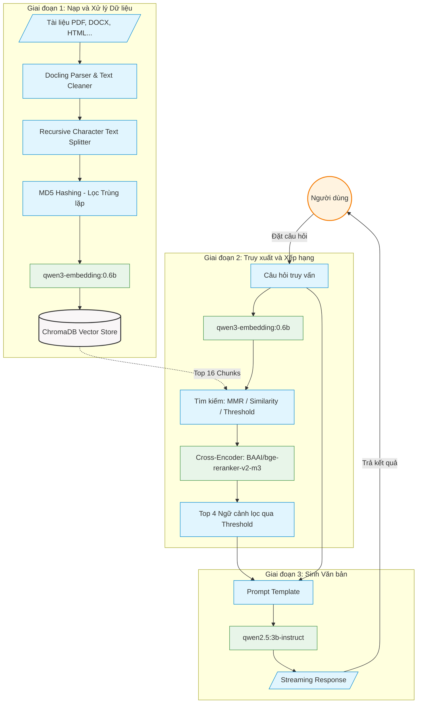

# HỆ THỐNG TRUY XUẤT VÀ TẠO VĂN BẢN (RAG) DÀNH CHO HỎI ĐÁP NỘI BỘ

## 1. Giới thiệu chung
Tài liệu này mô tả kiến trúc và quy trình triển khai hệ thống Hỏi-Đáp nội bộ dựa trên phương pháp Retrieval-Augmented Generation (RAG). Hệ thống được thiết kế để vận hành cục bộ (local environment), nhằm đảm bảo tính bảo mật của dữ liệu thông qua việc tích hợp các mô hình mã nguồn mở và cơ sở dữ liệu vector độc lập.

## 2. Kiến trúc hệ thống
Hệ thống được chia thành ba luồng xử lý chính:

* **Xử lý và Lưu trữ dữ liệu (Data Ingestion):** Sử dụng thư viện Docling để phân tích cú pháp các định dạng tài liệu (PDF, DOCX, PPTX, HTML, MD). Quá trình tiền xử lý tích hợp thuật toán băm MD5 cho từng phân đoạn văn bản (chunk) nhằm loại bỏ dữ liệu trùng lặp (deduplication) trước khi thực hiện nhúng (embedding) và lưu trữ vào ChromaDB.
* **Truy xuất và Xếp hạng (Retrieval & Reranking):** Hỗ trợ ba cấu hình truy xuất: Maximal Marginal Relevance (MMR), Cosine Similarity, và Threshold-based Similarity. Các tài liệu sau khi truy xuất được đánh giá và xếp hạng lại bằng mô hình Cross-Encoder (`BAAI/bge-reranker-v2-m3`) để tối ưu hóa độ chính xác của ngữ cảnh cung cấp cho mô hình ngôn ngữ.
* **Sinh văn bản (Generation):** Ngữ cảnh sau khi được lọc sẽ kết hợp với câu hỏi của người dùng và đưa vào mô hình ngôn ngữ lớn (LLM) `qwen2.5:3b-instruct` thông qua nền tảng Ollama, hỗ trợ trả kết quả theo thời gian thực (streaming response).

### Sơ đồ luồng dữ liệu (Data Flow Diagram)



## 3. Môi trường và Công nghệ
* **Ngôn ngữ lập trình:** Python 3.10+
* **Khung phát triển (Framework):** LangChain
* **Phân tích tài liệu:** Docling
* **Cơ sở dữ liệu Vector:** ChromaDB
* **Mô hình trích xuất đặc trưng (Embedding Model):** `qwen3-embedding:0.6b` (qua Ollama)
* **Mô hình ngôn ngữ (Generative Model):** `qwen2.5:3b-instruct` (qua Ollama)
* **Đo lường và Đánh giá (Evaluation):** Framework Ragas (sử dụng `qwen2.5:7b-instruct` làm mô hình giám khảo).

## 4. Hướng dẫn thiết lập môi trường

**Khởi tạo mã nguồn và thư viện:**
```bash
git clone [https://github.com/dbaotriett/EKGA-RAG-Chatbot.git](https://github.com/dbaotriett/EKGA-RAG-Chatbot.git)
cd EKGA-RAG-Chatbot
python -m venv venv
venv\Scripts\activate
pip install -r requirements.txt
```

**Khởi tạo dịch vụ Ollama:**
Yêu cầu hệ thống đã cài đặt Ollama. Thực thi các lệnh sau để tải các trọng số mô hình cần thiết:
```bash
ollama pull qwen2.5:3b-instruct
ollama pull qwen3-embedding:0.6b
ollama pull qwen2.5:7b-instruct
ollama pull nomic-embed-text
```

## 5. Hướng dẫn vận hành

### 5.1. Nạp dữ liệu (Ingestion)
Đặt các tệp tài liệu cần phân tích vào thư mục `./data/`, sau đó thực thi:
```bash
python ingest.py
```
* `--clear`: Xóa dữ liệu tồn tại trong ChromaDB trước khi nạp.
* `--no-dedup`: Bỏ qua quá trình kiểm tra MD5, nạp toàn bộ phân đoạn văn bản.

### 5.2. Thực thi truy vấn (Query)
Khởi động giao diện dòng lệnh để tương tác với hệ thống:
```bash
python query.py
```
* `--search [mmr|similarity|threshold]`: Chỉ định phương pháp truy xuất cơ sở.
* `--no-stream`: Vô hiệu hóa chế độ trả kết quả theo từng token.
* `--debug`: Chế độ nhà phát triển, hiển thị chi tiết ngữ cảnh trích xuất, điểm số xếp hạng (reranker score) và số lượng ký tự.

### 5.3. Đánh giá hệ thống (Evaluation)
Thực thi quá trình đánh giá hiệu suất hệ thống trên tập dữ liệu chuẩn (Benchmark) gồm 50 câu hỏi:
```bash
python evaluate_rag.py
```
Kết quả đo lường bốn chỉ số (Faithfulness, Answer Relevancy, Context Precision, Context Recall) sẽ được xuất ra tệp định dạng CSV (`rag_evaluation_results.csv`).

## 6. Giấy phép
Mã nguồn được phân phối theo giấy phép MIT. Chi tiết tham khảo tại tệp `LICENSE`.