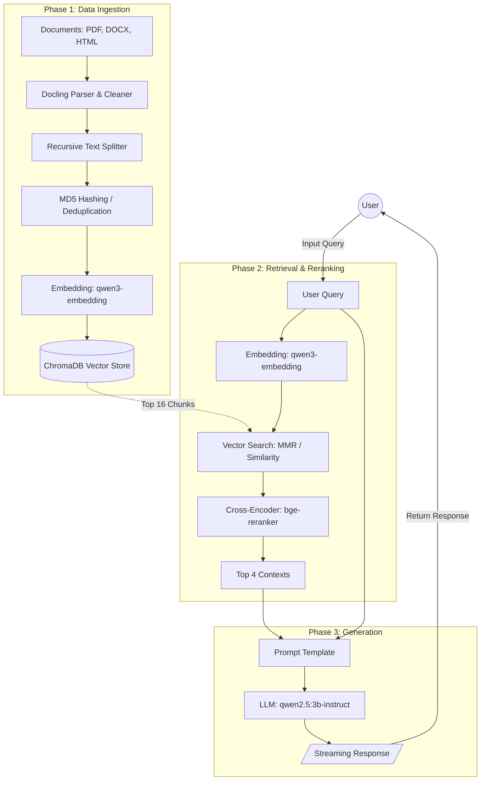

# RETRIEVAL-AUGMENTED GENERATION (RAG) SYSTEM FOR INTERNAL Q&A

## 1. Giới thiệu chung
Tài liệu này mô tả architecture và quy trình triển khai hệ thống Q&A nội bộ dựa trên phương pháp Retrieval-Augmented Generation (RAG). Hệ thống được thiết kế để vận hành trên local environment, nhằm đảm bảo data privacy thông qua việc tích hợp các open-source models và vector database độc lập.

## 2. System Architecture
Pipeline của hệ thống được chia thành ba luồng xử lý chính:

* **Data Ingestion:** Sử dụng thư viện Docling để parse các định dạng document (PDF, DOCX, PPTX, HTML, MD). Quá trình preprocessing tích hợp MD5 Hashing cho từng text chunk nhằm loại bỏ dữ liệu trùng lặp (deduplication) trước khi thực hiện embedding và index vào ChromaDB.
* **Retrieval & Reranking:** Hỗ trợ ba chiến lược retrieval: Maximal Marginal Relevance (MMR), Cosine Similarity, và Threshold-based Similarity. Các document sau khi retrieve được rerank bằng Cross-Encoder model (`BAAI/bge-reranker-v2-m3`) để tối ưu hóa độ chính xác của context cung cấp cho LLM.
* **Generation:** Context sau khi filter sẽ được kết hợp với query của user và đưa vào Large Language Model (LLM) `qwen2.5:3b-instruct` thông qua nền tảng Ollama, hỗ trợ trả kết quả dạng streaming response.

### Data Flow Diagram



## 3. Tech Stack
* **Programming Language:** Python 3.10+
* **Framework:** LangChain
* **Document Parsing:** Docling
* **Vector Database:** ChromaDB
* **Embedding Model:** `qwen3-embedding:0.6b` (qua Ollama)
* **Generative Model (LLM):** `qwen2.5:3b-instruct` (qua Ollama)

## 4. Environment Setup

**Khởi tạo source code và dependencies:**
```bash
git clone [https://github.com/dbaotriett/EKGA-RAG-Chatbot.git](https://github.com/dbaotriett/EKGA-RAG-Chatbot.git)
cd EKGA-RAG-Chatbot
python -m venv venv
venv\Scripts\activate
pip install -r requirements.txt
```

**Khởi tạo dịch vụ Ollama:**
Yêu cầu hệ thống đã cài đặt Ollama. Thực thi các lệnh sau để pull các models cần thiết:
```bash
ollama pull qwen2.5:3b-instruct
ollama pull qwen3-embedding:0.6b
```

## 5. Hướng dẫn vận hành

### 5.1. Data Ingestion
Đặt các document cần xử lý vào thư mục `./data/`, sau đó thực thi:
```bash
python ingest.py
```
* `--clear`: Xóa dữ liệu tồn tại trong ChromaDB trước khi ingest.
* `--no-dedup`: Bỏ qua quá trình MD5 hashing, ingest toàn bộ chunks.

### 5.2. Query & Inference
Khởi động Command Line Interface (CLI) để tương tác với hệ thống:
```bash
python query.py
```
* `--search [mmr|similarity|threshold]`: Chỉ định retrieval strategy.
* `--no-stream`: Vô hiệu hóa chế độ streaming response.
* `--debug`: Kích hoạt debug mode, hiển thị chi tiết extracted context, reranker score và token size.

## 6. License
Mã nguồn được phân phối theo giấy phép MIT. Chi tiết tham khảo tại tệp `LICENSE`.